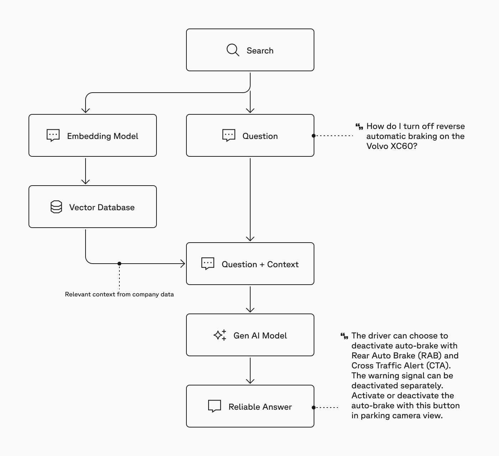

# RAG Chat Bot - Restaurant Menu
This repository builds a simple RAG chatbot in Python using Pinecone for the vector database and embedding model, Llama-3.2 for the LLM, and LangChain for the RAG workflow. The project combines key technologies to create a responsive, efficient chatbot capable of answering complex questions by retrieving and training the LLM with the knowledge based database provided before generating a response.

## 🧑‍🏫 Project Use Cases
This project does this :

1. Answer customer queries about the menu, including dish descriptions, prices, and ingredients.
2. Provide information about dietary options (vegetarian, gluten-free, etc.).
3. Assist with reservations and opening hours.
4. Offer personalized dish recommendations based on customer preferences.
5. Handle frequently asked questions about the restaurant's policies and services.

## 🚀 Getting Started
1. Clone this repository and install dependencies.
2. Set up your Pinecone and Hugging Face API keys.
3. Configure the embedding model in Pinecone to manage the vector search capabilities.
4. Run the chatbot script to interact with the RAG chatbot and explore its features.

There is a detailed Jupyter Notebook which covers all the process.

## ⚙️ Workflow

## Ongoing Work
~ Making a UI to ask queries on streamlit.

~ passing data factory to embed into the model.
